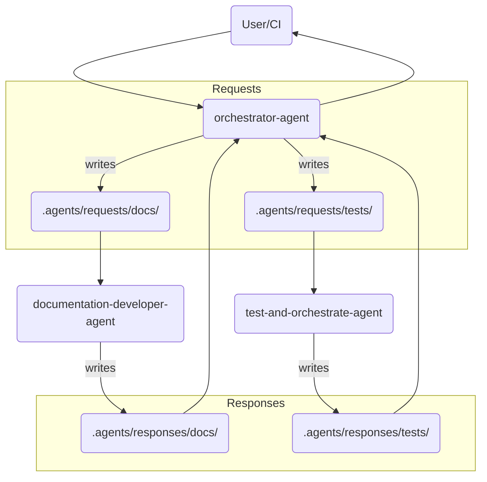

# Orchestrated Agent Communication Pipeline Design

## Purpose
Define the file-based request–response pipeline used by `orchestrator-agent` to dispatch work to specialised agents and collect their results.

## Actors
- **orchestrator-agent** – central dispatcher and correlation hub.
- **documentation-developer-agent** – consumes documentation requests.
- **test-and-orchestrate-agent** – consumes testing requests.
- *(future)* other domain-specific agents (e.g., security-scanner-agent, dependency-update-agent).

## High-Level Flow



## Directory Layout
```
.agents/
├── requests/                # Outbound work from orchestrator-agent
│   ├── docs/                #  → documentation-developer-agent
│   ├── tests/               #  → test-and-orchestrate-agent
│   └── <new-agent>/         #  → future agents
├── responses/               # Inbound results to orchestrator-agent
│   ├── docs/
│   ├── tests/
│   └── <new-agent>/
├── logs/                    # Unified activity logs
└── orchestrator-state.json  # Last processed IDs, cursor positions, etc.
```

## Request File Contract
- **Location**: `.agents/requests/<target>/`
- **Filename**: `<timestamp>_<uuid>_<target>.md`
- **YAML Front-Matter**:
  | field    | description                               |
  | -------- | ----------------------------------------- |
  | id       | unique request identifier                 |
  | from     | `orchestrator-agent`                      |
  | to       | target agent name                         |
  | priority | `critical` \| `high` \| `medium` \| `low` |
  | status   | `pending` (default)                       |
  | sent-at  | ISO-8601 UTC timestamp                    |
  | meta     | free-form json for additional context     |

- **Body**: Structured content expected by the target agent (e.g., Markdown schema for documentation requests).

## Response File Contract
- **Location**: `.agents/responses/<target>/`
- **Filename**: `<id>.response.md` (matches request `id`)
- **YAML Front-Matter**:
  | field        | description                                        |
  | ------------ | -------------------------------------------------- |
  | id           | request identifier (for correlation)               |
  | processed-by | name & version of the agent producing the response |
  | processed-at | ISO-8601 UTC timestamp                             |
  | status       | `completed` \| `failed` \| `partial`               |
  | errors       | array of error strings (optional)                  |

- **Body**: Human-readable summary of work performed, links to artefacts, or failure diagnostics.

## Orchestrator-Agent Responsibilities
1. **Ingress Monitoring** – watch `.agents/inbox/` (CLI, API, or Git hooks) for new user requests.
2. **Normalisation** – convert incoming payloads into canonical Request files, assigning `id` and deciding `priority`.
3. **Routing** – dispatch requests into the appropriate `.agents/requests/<target>/` directory.
4. **Correlation** – poll `.agents/responses/` for matching `id` files; upon arrival, collate results, emit notifications, and mark the original request as closed.
5. **Retry & Escalation** – if a response is not received within the SLA (configurable by priority), re-queue or raise an alert.

## Target Agent Responsibilities
- **Consumption** – process request files in FIFO order, respecting `priority`.
- **Result Emission** – write a Response file with identical `id` into their designated responses folder.
- **Idempotency** – ensure reprocessing the same Request twice yields the same outcome to support retry logic.

## Error-Handling Strategy
| scenario                              | orchestrator action                                 |
| ------------------------------------- | --------------------------------------------------- |
| malformed user request                | move file to `.agents/inbox/rejected/` with reason  |
| unknown target agent                  | log error, notify requester                         |
| request processing time-out           | escalate priority, optionally assign fallback agent |
| response file missing required fields | mark request as `failed`, include agent error       |

## Extensibility Guidelines
- Adding a new agent requires only two directories: `.agents/requests/<new>` and `.agents/responses/<new>`.
- Orchestrator detects new directories at runtime via glob matching; no hard-coded list required.
- Shared JSON-schema definitions for Request & Response front-matter live in `.agents/schemas/` to maintain contract integrity.

## Request Types

### API Change Request
```markdown
---
type: api-change
---
- Endpoint modified
- New parameters
- Response format changes
- Breaking changes flag
```

### Bug Fix Documentation
```markdown
---
type: bug-fix
---
- Issue description
- Root cause
- Solution implemented
- Testing verification
```

### Feature Documentation
```markdown
---
type: feature
---
- Feature description
- API additions
- Configuration changes
- Migration guide needed
```

### Refactor Notes
```markdown
---
type: refactor
---
- Components affected
- Behavior changes (if any)
- Performance impacts
- No API changes flag
```

## Priority Levels

1. **Critical** (Process immediately)
   - Security fixes
   - Breaking changes
   - Production issues

2. **High** (Process within cycle)
   - New features
   - API changes
   - Bug fixes

3. **Medium** (Process when available)
   - Refactors
   - Optimizations
   - Clarifications

4. **Low** (Batch process)
   - Typos
   - Formatting
   - Minor updates

## Integration Points

### Backend Developer Agent
- Creates requests after code changes
- Reads acknowledgments before pushing
- Validates documentation accuracy

### Test Agent
- Documents test coverage changes
- Reports new test scenarios
- Updates test documentation

### Documentation Agent
- Monitors request queue continuously
- Validates against source code
- Maintains consistency across docs
- Creates acknowledgments

## Best Practices

1. **Atomic Requests**: One logical change per request
2. **Clear Descriptions**: Include all context needed
3. **File References**: Always include affected files
4. **Verification**: Include how changes were tested
5. **Backwards Compatibility**: Note any breaking changes

## Error Handling

### Failed Processing
If documentation agent cannot process a request:
```markdown
---
status: failed
reason: "Cannot locate referenced file"
---
```

### Retry Mechanism
Failed requests remain in queue with `.failed` suffix for manual intervention.

## Monitoring

### Queue Health
```bash
# Check pending requests
ls -la .agents/docs-requests/*.md | wc -l

# Check processing rate
ls -la .agents/docs-requests/processed/*.ack.md | wc -l
```

### Agent Activity
Each agent logs activities to `.agents/logs/[agent-name].log`

## Future Enhancements

1. **Webhook Integration**: Real-time notifications
2. **Priority Queue**: Automatic priority sorting
3. **Conflict Resolution**: Handle concurrent updates
4. **Metrics Dashboard**: Processing statistics
5. **Auto-validation**: Source code verification 