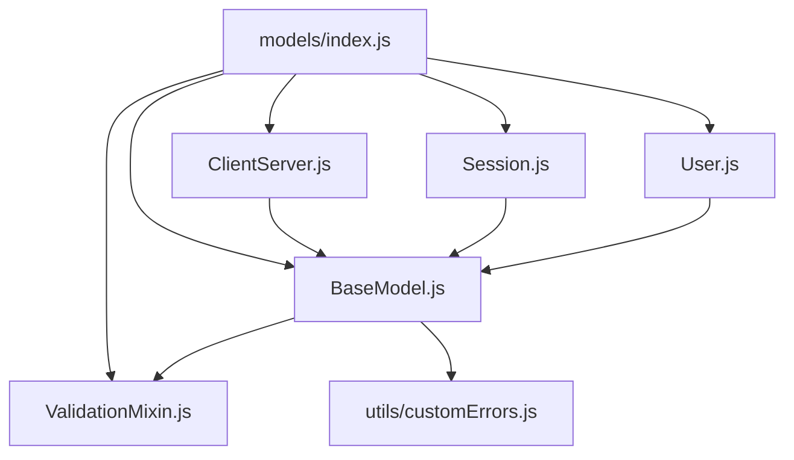

# Model Layer Architecture

## Overview

The Model Layer is the foundation of our data flow architecture, providing structured, validated data objects that flow through all layers of the application. This document outlines the architectural principles, dependency management strategies, and best practices for working with models.

## Architectural Principles

### 1. Single Responsibility
Each model class has a single, well-defined responsibility:
- **User**: Identity, authentication, and authorization
- **Session**: Authentication state and session management  
- **ClientServer**: Multi-tenant configuration and API client management
- **BaseModel**: Common functionality shared across all models

### 2. Layered Dependencies
```
┌─────────────────────────────────────────┐
│                Routes                   │ ← HTTP Request/Response
├─────────────────────────────────────────┤
│              Controllers                │ ← Request validation & response formatting
├─────────────────────────────────────────┤
│               Services                  │ ← Business logic & orchestration
├─────────────────────────────────────────┤
│              Repository                 │ ← Database operations
├─────────────────────────────────────────┤
│                Models                   │ ← Data structure & validation
├─────────────────────────────────────────┤
│              Database                   │ ← Persistent storage
└─────────────────────────────────────────┘
```

### 3. Dependency Direction
Dependencies MUST flow downward only:
- ✅ Routes → Controllers → Services → Repository → Models
- ❌ Models → Services (NEVER)
- ❌ Models → Repository (NEVER) 
- ❌ Models → Controllers (NEVER)

## Model Layer Structure

### Core Components

```
models/
├── index.js                  # Centralized exports (aggregation layer)
├── base/
│   ├── BaseModel.js          # Foundation class
│   └── ValidationMixin.js    # Validation utilities
├── User.js                   # User domain model
├── Session.js                # Session domain model
├── ClientServer.js           # Client server domain model
└── functional/
    └── index.js              # Functional programming utilities
```

### Dependency Map



## Critical Dependency Management

### The Circular Dependency Problem

**WRONG - Creates Circular Dependencies:**
```javascript
// BaseModel.js
import { NotFoundError } from '../../middleware/errorHandler.js';  // ❌

// errorHandler.js  
import clientServerService from '../services/clientServer.js';      // ❌

// clientServer.js
import { ClientServer, User, Session } from '../models/index.js';   // ❌
```

**This creates the cycle:**
```
BaseModel.js → errorHandler.js → clientServer.js → models/index.js → User.js → BaseModel.js
```

### The Solution - Isolated Error Classes

**CORRECT - Breaks Circular Dependencies:**
```javascript
// utils/customErrors.js - Pure error definitions
export class NotFoundError extends Error { /* ... */ }
export class ValidationError extends Error { /* ... */ }
export class AuthError extends Error { /* ... */ }

// BaseModel.js
import { NotFoundError } from '../../utils/customErrors.js';  // ✅

// errorHandler.js  
import { NotFoundError, ValidationError } from '../utils/customErrors.js';  // ✅
import clientServerService from '../services/clientServer.js';  // ✅

// clientServer.js
import { NotFoundError, ValidationError } from '../utils/customErrors.js';  // ✅
import { ClientServer, User, Session } from '../models/index.js';  // ✅
```

## Import Strategy Guidelines

### 1. Models Import Only Utilities
Models should ONLY import:
- **Base classes**: `BaseModel`, `ValidationMixin`
- **Pure utilities**: `utils/customErrors.js`, `utils/validators.js`
- **Constants**: `config/constants.js`
- **Other models** (with caution - see cross-model relationships)

```javascript
// ✅ ALLOWED imports in models
import BaseModel from './base/BaseModel.js';
import { ValidationError } from '../utils/customErrors.js';
import { ROLES } from '../config/constants.js';

// ❌ FORBIDDEN imports in models  
import userService from '../services/userService.js';        // Service layer
import usersRepo from '../repo/usersRepo.js';               // Repository layer
import authController from '../controllers/authController.js'; // Controller layer
```

### 2. Service Layer Imports Models
Services import models to work with structured data:

```javascript
// services/userService.js
import { User, Session } from '../models/index.js';  // ✅
import { ValidationError } from '../utils/customErrors.js';  // ✅
import usersRepo from '../repo/usersRepo.js';  // ✅
```

### 3. Cross-Model Relationships

**Direct Import for Strong Coupling:**
```javascript
// Session.js - Strong relationship with User
import User from './User.js';  // ✅ Direct import

export class Session extends BaseModel {
    attachUser(user) {
        if (!(user instanceof User)) {
            throw new ValidationError('Invalid user instance');
        }
        this.user = user;
        return this;
    }
}
```

**Lazy Loading for Weak Coupling:**
```javascript
// ClientServer.js - Weak relationship with User
export class ClientServer extends BaseModel {
    async getOwner() {
        // Import only when needed
        const { User } = await import('./User.js');  // ✅ Lazy import
        return User.fromDb(this.user_id);
    }
}
```

## Error Handling Architecture

### Error Class Hierarchy

```javascript
// utils/customErrors.js
export class BaseError extends Error {
    constructor(message, statusCode = 500, details = null) {
        super(message);
        this.name = this.constructor.name;
        this.statusCode = statusCode;
        this.details = details;
    }
}

export class ValidationError extends BaseError {
    constructor(message, errors = [], statusCode = 400) {
        super(message, statusCode);
        this.errors = errors;
    }
}

export class NotFoundError extends BaseError {
    constructor(message, statusCode = 404) {
        super(message, statusCode);
    }
}

export class AuthError extends BaseError {
    constructor(message, statusCode = 401) {
        super(message, statusCode);
    }
}

export class ConflictError extends BaseError {
    constructor(message, statusCode = 409) {
        super(message, statusCode);
    }
}
```

### Model Error Usage

```javascript
// BaseModel.js
import { NotFoundError, ValidationError } from '../../utils/customErrors.js';

export default class BaseModel {
    static fromDb(dbRow) {
        if (!dbRow) {
            throw new NotFoundError(`${this.name} not found`);
        }
        // ... implementation
    }
    
    validate() {
        if (!this.isValid()) {
            throw new ValidationError(
                'Validation failed',
                this.getErrors()
            );
        }
        return this;
    }
}
```

## Testing Strategy

### Unit Testing Models
Models are isolated and easy to test:

```javascript
// __tests__/User.test.js
import { User } from '../models/index.js';
import { ValidationError } from '../utils/customErrors.js';

describe('User Model', () => {
    test('fromCredentials validates email format', () => {
        expect(() => {
            User.fromCredentials({ email: 'invalid', password: 'test123' });
        }).toThrow(ValidationError);
    });
    
    test('toApiResponse removes sensitive data', () => {
        const user = new User('123', 'test@example.com', 'hashedpass');
        const safe = user.toApiResponse();
        
        expect(safe.passwordHash).toBeUndefined();
        expect(safe.email).toBe('test@example.com');
    });
});
```

### Integration Testing Models
Test model interactions with repository layer:

```javascript
// __tests__/models.integration.test.js
import { User, Session } from '../models/index.js';
import usersRepo from '../repo/usersRepo.js';

describe('Model Integration', () => {
    test('User.fromDb creates valid instance', async () => {
        const dbRow = await usersRepo.create(testSchema, userData);
        const user = User.fromDb(dbRow);
        
        expect(user).toBeInstanceOf(User);
        expect(user.isValid()).toBe(true);
    });
});
```

## Best Practices

### ✅ DO

1. **Keep models pure** - No business logic, only data structure and validation
2. **Use factory methods** - `fromDb()`, `fromCredentials()`, `fromRequestBody()`
3. **Validate on construction** - Call `validate()` in constructors
4. **Implement all abstract methods** - `toDatabaseObject()`, `toDatabaseArray()`
5. **Use proper error types** - Import from `utils/customErrors.js`
6. **Test thoroughly** - Unit tests for each model method
7. **Document relationships** - Clear comments about model dependencies

### ❌ DON'T

1. **Import services or repos** - Models are the lowest layer
2. **Include business logic** - That belongs in services
3. **Create circular dependencies** - Follow the dependency direction rules
4. **Use `new` directly** - Use factory methods instead
5. **Modify models after creation** - Prefer immutable patterns
6. **Mix concerns** - Keep data structure separate from business rules
7. **Skip validation** - Always validate input data

## Troubleshooting Circular Dependencies

### Detection
Look for these patterns in import errors:
```
ReferenceError: Cannot access '__vite_ssr_export_default__' before initialization
```

### Common Causes
1. **Model → Service imports** - Models importing from service layer
2. **Cross-dependencies** - Two modules importing each other
3. **Deep chains** - A→B→C→D→A cycles

### Resolution Steps
1. **Map the cycle** - Trace import chain to find the loop
2. **Identify the break point** - Find the weakest dependency  
3. **Extract shared code** - Move shared utilities to separate files
4. **Use lazy imports** - Import only when needed
5. **Restructure if needed** - Sometimes requires architectural changes

### Prevention
1. **Follow layer rules** - Dependencies only flow downward
2. **Use dependency injection** - Pass dependencies as parameters
3. **Create pure utilities** - Extract shared code to utils
4. **Review imports regularly** - Check for unnecessary dependencies

## Monitoring and Maintenance

### Regular Reviews
- Weekly import dependency audits
- Monthly architecture reviews  
- Quarterly refactoring sessions

### Metrics to Track
- Number of circular dependencies (should be 0)
- Model test coverage (target: >95%)
- Model complexity (lines of code per model)
- Import graph depth

### Documentation Updates
- Update this document when adding new models
- Document any architectural decisions
- Maintain import dependency diagrams 