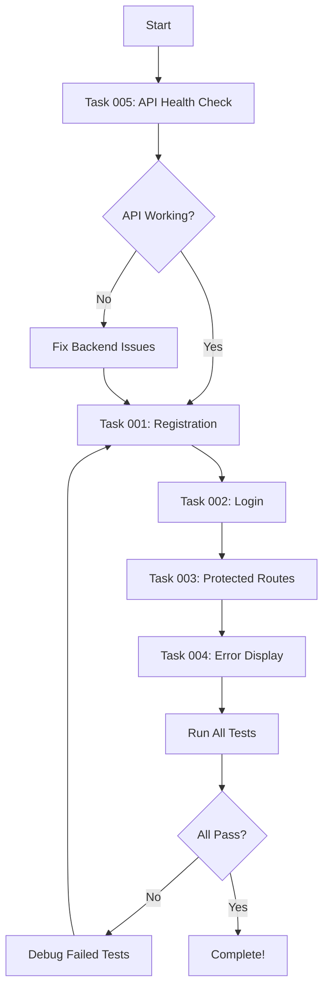

# Frontend Playwright Test Fix - Task Overview

## 📋 Task Summary

Based on the Playwright test results (0/21 tests passing), we have identified 5 critical tasks to fix the authentication system and get all tests passing.

## 🎯 Task Priority

### 🔴 CRITICAL (Must fix first)
1. **[Task 001](./001-fix-registration-redirect.md)** - Fix Registration Redirect
   - Blocks: 8 tests
   - Issue: Registration not redirecting to login page

2. **[Task 002](./002-fix-login-redirect.md)** - Fix Login Redirect to Home  
   - Blocks: 13 tests
   - Issue: Login not redirecting to home page

3. **[Task 003](./003-fix-protected-routes.md)** - Fix Protected Route Access Control
   - Blocks: 6 tests
   - Issue: Protected routes not enforcing authentication

### 🟡 HIGH (Fix after critical)
4. **[Task 004](./fixed/004-fix-error-display.md)** - Fix Error Message Display
   - Affects: All tests
   - Issue: Validation and API errors not shown

5. **[Task 005](./005-backend-api-health-check.md)** - Backend API Health Check
   - Diagnostic task
   - Issue: Potential backend/CORS issues

## 📊 Impact Analysis

| Task | Tests Blocked | Severity | Estimated Effort |
| ---- | ------------- | -------- | ---------------- |
| 001  | 8             | Critical | 2-4 hours        |
| 002  | 13            | Critical | 2-4 hours        |
| 003  | 6             | Critical | 1-2 hours        |
| 004  | All           | High     | 1-2 hours        |
| 005  | N/A           | High     | 1 hour           |

## 🔄 Recommended Workflow



## ✅ Success Metrics

- [ ] All 21 Playwright tests passing
- [ ] Registration flow works end-to-end
- [ ] Login flow works end-to-end
- [ ] Protected routes enforce authentication
- [ ] Error messages display properly
- [ ] No console errors or warnings

## 🚀 Quick Start

1. Start with Task 005 to verify backend health
2. Fix Task 001-003 in order (they build on each other)
3. Fix Task 004 for better debugging
4. Run tests after each fix:
   ```bash
   npm run test:e2e
   ```

## 📝 Testing Commands

```bash
# Run all tests
npm run test:e2e

# Run specific test file
npx playwright test auth-flow.spec.js

# Debug mode
npm run test:e2e:debug

# UI mode
npm run test:e2e:ui
```

## 🎉 Definition of Done

- All 21 tests pass consistently
- No flaky tests
- Code changes are clean (no commented debug code)
- Documentation updated if needed
- Changes committed with descriptive message 