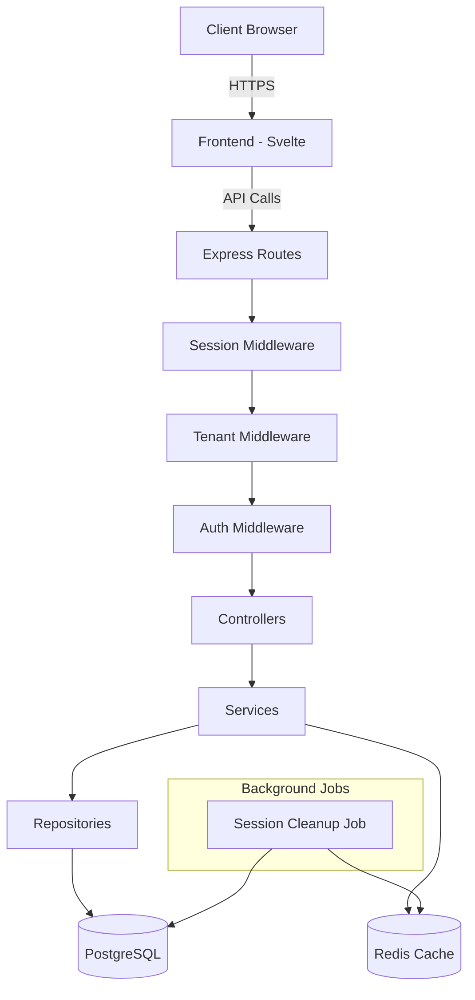
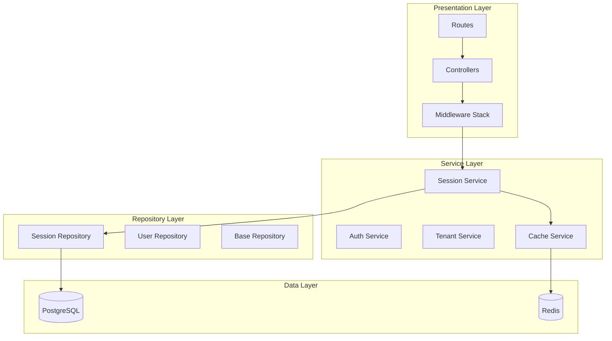
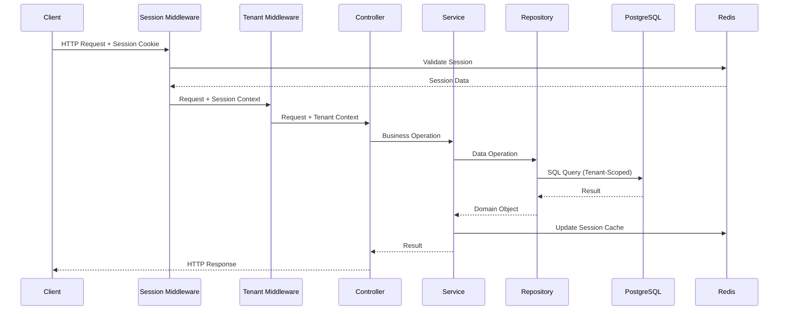
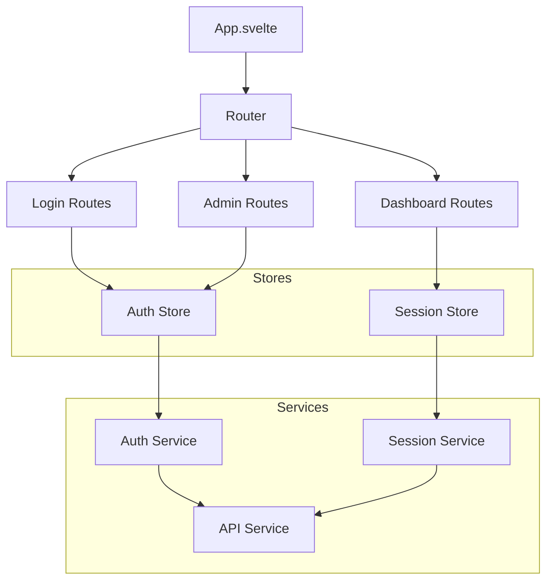

# System Architecture & Design Patterns (`rules/system.md`)

**This document is the canonical source for the project's system architecture, design patterns, and technical guidelines. All development work must align with the principles and structures outlined herein. Deviations require explicit approval and documentation.**

## 1. Overall Architecture Philosophy

The system follows a **Layered Architecture with Domain Services** approach, prioritizing simplicity, security, and maintainability over premature optimization. This architecture was chosen to address multi-tenant session management requirements while avoiding over-engineering.

**Core Principles:**
- **Clear Separation of Concerns**: Each layer has distinct responsibilities
- **Proven Solutions Over Custom**: Leverage established libraries and patterns
- **Security by Design**: Built-in security measures at every layer
- **Tenant Isolation**: Simple namespace-based multi-tenancy
- **MVP-Focused**: Prioritize essential functionality over complex features



## 2. Backend System Patterns

### 2.1. Core Backend Architecture

**Layered Architecture Implementation:**

- **Presentation Layer** (`controllers/`, `routes/`): Handles HTTP requests, response formatting, and basic input validation
- **Service Layer** (`services/`): Contains business logic, orchestrates operations, enforces business rules
- **Repository Layer** (`repositories/`): Abstracts data access with tenant-aware queries
- **Data Layer**: PostgreSQL with Redis caching for session performance

**Key Architectural Decisions:**
- Single database with tenant-prefixed session tables (`sessions_tenant_{tenant_id}`)
- JWT + Session Hybrid approach for stateless tokens with server-side validation
- Redis integration for session caching and performance optimization
- Express.js middleware pattern for cross-cutting concerns



### 2.2. Key Backend Design Patterns

**Repository Pattern**
- **Purpose**: Encapsulates data access logic and provides uniform interface for domain objects
- **Implementation**: `SessionRepository`, `UserRepository` with tenant-aware queries
- **Benefits**: Isolates business logic from database details, simplifies testing, centralizes tenant isolation

**Factory Pattern**
- **Purpose**: Creates objects without exposing instantiation logic
- **Implementation**: `SessionFactory` creates session objects with proper tenant context and security tokens
- **Benefits**: Ensures consistent session creation, supports different session types (admin, user, API)

**Middleware Pattern**
- **Purpose**: Cross-cutting concerns in request-response cycle
- **Implementation**: 
  - `SessionMiddleware`: Validates session cookies
  - `TenantMiddleware`: Resolves tenant context
  - `AuthMiddleware`: Enforces authentication
  - `ValidationMiddleware`: Input validation
- **Benefits**: Clean separation of concerns, flexible composition for different routes

**Service Layer Pattern**
- **Purpose**: Centralizes business logic and orchestrates operations
- **Implementation**: Domain-specific services with clear responsibilities
- **Benefits**: Reusable business logic, easier testing, clear API boundaries

### 2.3. Backend Component Relationships & Flows

**Primary Request Flow:**


**Session Lifecycle:**
1. **Creation**: Client authenticates → SessionService creates session → Repository persists → Cache stores
2. **Validation**: Middleware validates cookie → Cache lookup → Database fallback if needed
3. **Updates**: Service modifies session → Repository updates → Cache synchronizes
4. **Cleanup**: Background job removes expired sessions from database and cache

### 2.4. Backend Module/Directory Structure

```
backend/src/
├── config/                 # Configuration management
│   ├── database.js         # Database connection settings
│   ├── session.js          # Session configuration
│   └── security.js         # Security-related config
├── controllers/            # Request handlers
│   ├── auth.controller.js  # Authentication endpoints
│   ├── session.controller.js # Session management
│   └── admin.controller.js # Administrative functions
├── middleware/             # Cross-cutting concerns
│   ├── auth.middleware.js  # Authentication validation
│   ├── session.middleware.js # Session validation
│   ├── tenant.middleware.js # Tenant context resolution
│   └── validation.middleware.js # Input validation
├── models/                 # Data models
│   ├── session.model.js    # Session entity
│   ├── user.model.js       # User entity
│   └── tenant.model.js     # Tenant entity
├── services/               # Business logic
│   ├── session/            # Session-specific services
│   │   ├── session.service.js # Core session operations
│   │   ├── validation.service.js # Session validation logic
│   │   ├── cleanup.service.js # Session cleanup
│   │   └── security.service.js # Security operations
│   ├── auth.service.js     # Authentication logic
│   ├── tenant.service.js   # Tenant operations
│   └── cache.service.js    # Redis operations
├── repositories/           # Data access layer
│   ├── session.repository.js # Session data access
│   ├── user.repository.js  # User data access
│   └── base.repository.js  # Common repository functionality
├── utils/                  # Utility functions
│   ├── security.util.js    # Security helpers
│   ├── crypto.util.js      # Cryptographic operations
│   ├── validation.util.js  # Validation helpers
│   └── tenant.util.js      # Tenant utilities
├── jobs/                   # Background processes
│   └── session-cleanup.job.js # Expired session cleanup
└── routes/                 # Route definitions
    ├── auth.routes.js      # Authentication routes
    ├── session.routes.js   # Session management routes
    └── admin.routes.js     # Administrative routes
```

## 3. Frontend System Patterns

### 3.1. Core Frontend Architecture

**Component-Based SPA with Svelte**
- **Framework**: Svelte with Vite for build tooling
- **Architecture**: Component-based with centralized state management
- **Routing**: Client-side routing for SPA experience
- **State Management**: Svelte stores for session and authentication state



### 3.2. Key Frontend Technical Decisions & Patterns

**State Management**
- **Approach**: Svelte stores for reactive state management
- **Stores**: `auth.store.js` for authentication state, `session.store.js` for session data
- **Benefits**: Simple, reactive, built into Svelte framework

**API Communication**
- **Pattern**: Service layer abstraction over fetch API
- **Implementation**: Dedicated service classes for different domains
- **Error Handling**: Centralized error handling with user-friendly messages

**Component Design**
- **Pattern**: Single File Components (SFC) with clear prop interfaces
- **Organization**: Feature-based directory structure
- **Reusability**: Shared components in dedicated directories

### 3.3. Frontend Component Relationships & Structure

```
frontend/src/
├── stores/                 # State management
│   ├── auth.store.js       # Authentication state
│   └── session.store.js    # Session management state
├── services/               # API communication
│   ├── auth.service.js     # Authentication API calls
│   ├── session.service.js  # Session API calls
│   └── api.util.js         # Common API utilities
├── components/             # Reusable components
│   ├── auth/               # Authentication components
│   │   ├── LoginForm.svelte
│   │   └── LogoutButton.svelte
│   └── session/            # Session management components
│       ├── SessionManager.svelte
│       └── SessionList.svelte
├── routes/                 # Page components
│   ├── login/              # Login page
│   ├── dashboard/          # Main dashboard
│   └── admin/              # Administrative interface
└── utils/                  # Utility functions
    ├── session.util.js     # Session helpers
    └── validation.util.js  # Client-side validation
```

### 3.4. Critical Frontend Implementation Paths/Flows

**Authentication Flow:**
1. User submits login form → AuthService validates → AuthStore updates → Redirect to dashboard
2. Page load → SessionStore checks existing session → Auto-login or redirect to login
3. Logout → AuthService invalidates session → AuthStore clears → Redirect to login

**Session Management Flow:**
1. Admin views session list → SessionService fetches → SessionStore updates → Component renders
2. Admin terminates session → SessionService calls API → SessionStore removes → UI updates
3. Session expires → Middleware detects → AuthStore clears → Redirect with notification

## 4. Cross-Cutting Concerns & Platform-Wide Patterns

### Error Handling
- **Backend**: Centralized error middleware with structured error responses
- **Frontend**: Service layer catches and transforms errors for user consumption
- **Logging**: All errors logged with context (tenant, user, request ID)

### Logging
- **Backend**: Structured logging with Winston or similar, including tenant context
- **Frontend**: Error tracking and user action logging for debugging
- **Format**: JSON format with correlation IDs for request tracing

### Validation
- **Backend**: Input validation middleware using Joi or similar
- **Frontend**: Client-side validation for immediate feedback
- **Shared**: Common validation schemas where possible

### Security
- **Authentication**: JWT tokens with server-side session validation
- **Session Management**: Secure HTTP-only cookies with proper flags
- **CSRF Protection**: Built into session middleware
- **Rate Limiting**: API endpoint protection against abuse
- **Tenant Isolation**: Database-level separation with query scoping

### Configuration Management
- **Environment Variables**: `.env` files for environment-specific config
- **Validation**: Configuration validation on startup
- **Secrets**: Separate secret management (not in code)

### API Design Principles
- **RESTful**: Standard HTTP methods and status codes
- **Versioning**: URL-based versioning (`/api/v1/`)
- **Pagination**: Consistent pagination for list endpoints
- **Error Format**: Standardized error response structure

### Testing Strategy
- **Unit Tests**: Service and utility function testing
- **Integration Tests**: API endpoint testing with test database
- **E2E Tests**: Critical user flows with Playwright
- **Coverage**: Minimum 80% coverage for service layer

## 5. Key Technology Stack Summary

### Backend
- **Runtime**: Node.js (LTS version)
- **Framework**: Express.js
- **Database**: PostgreSQL with connection pooling
- **Cache**: Redis for session storage and performance
- **Authentication**: JWT with express-session
- **Security**: bcrypt for hashing, helmet for security headers
- **Validation**: Joi for input validation
- **Testing**: Jest for unit/integration tests

### Frontend
- **Framework**: Svelte with SvelteKit routing
- **Build Tool**: Vite
- **State Management**: Svelte stores
- **HTTP Client**: Native fetch with service abstraction
- **Testing**: Vitest for unit tests, Playwright for E2E

### DevOps & Common Tools
- **Containerization**: Docker with docker-compose
- **Database Migrations**: Custom migration system
- **Process Management**: PM2 for production
- **Background Jobs**: Node-cron for scheduled tasks
- **Monitoring**: Structured logging with correlation IDs

### Key Libraries
- **Backend**: express-session, connect-redis, cors, helmet, compression
- **Frontend**: No heavy external dependencies beyond Svelte ecosystem
- **Shared**: Common validation and type definitions

---

**Implementation Priority:**
1. **Phase 1** (2-3 weeks): Core session functionality with basic tenant isolation
2. **Phase 2** (1-2 weeks): Security enhancements and admin interface
3. **Phase 3** (1 week): Performance optimization and monitoring

_This document should be reviewed and updated as the system evolves. All architectural changes must be reflected here to maintain consistency._ 